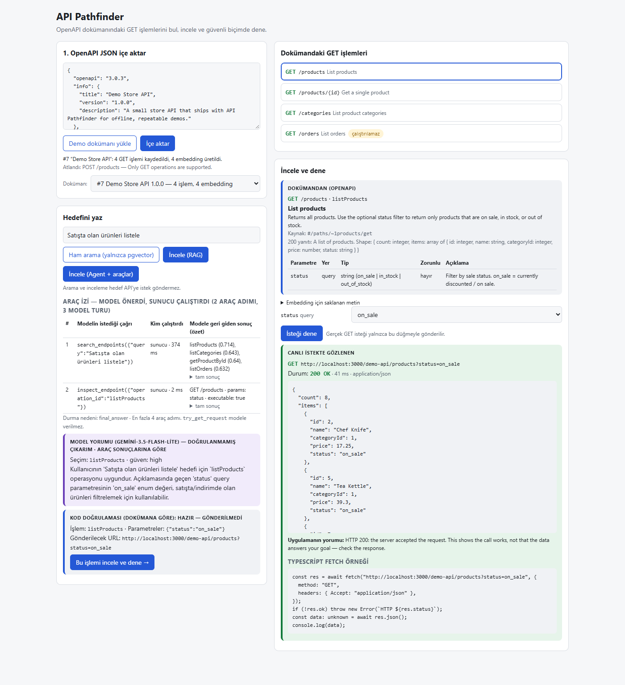
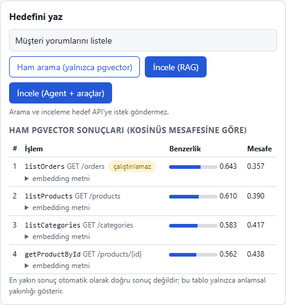

# 🧭 API Pathfinder

**Find the right endpoint. Try it safely.**

> Upload an OpenAPI 3.x JSON document and describe your goal in plain language ("How do I list the products that are
> on sale?"). Pathfinder finds the matching **GET** operation with semantic search, reviews it with Gemini, validates
> the parameters against the document, and sends a real GET request to an allowlisted server **only when you click
> "İsteği dene" (Try the request)**.

A small, deliberately scoped prototype: it indexes the GET operations of an OpenAPI 3.x JSON document in
PostgreSQL/pgvector, finds the operation that matches a natural-language goal (embeddings + RAG + a bounded Gemini
function-calling loop), validates the model's proposal against the document in code, and sends a real, allowlisted
GET request only after explicit user confirmation.

> The app's user interface is in **Turkish**. UI labels quoted below are given in Turkish with an English translation.



📘 A 27-page guide in Turkish, written for non-developers too: [docs/API-Pathfinder-Rehber.pdf](docs/API-Pathfinder-Rehber.pdf)
(concepts, architecture, database and Docker, the AI part, setup and a screen-by-screen guide).

This is not a "magic product that connects to any API". The scope is intentionally small (see [Known limitations](#known-limitations)).

## What it does

1. Validates the OpenAPI JSON (pasted text or a selected `.json` file), extracts the GET operations, resolves local `$ref`s and stores them in PostgreSQL.
2. Creates an embedding from each operation's description in the document (`gemini-embedding-2`, 768 dimensions) and writes it to pgvector.
3. Shows the operations that are semantically closest to the goal, with their scores. The raw search view uses no model.
4. Two review modes:
   - **RAG (fixed chain):** search → give the retrieved operations to the model → get a structured JSON answer.
   - **Agent (bounded loop):** the model chooses which of the `search_endpoints` / `inspect_endpoint` tools to call, the server runs the tool, and the result goes back to the model. The loop is limited to at most 4 tool steps.
5. **Code** validates the model's proposal. Operations that are not in the document are discarded, undefined parameters are removed, and missing required parameters are requested from the user.
6. If the user confirms, a real GET request is sent. The UI shows the URL, status code, a size-limited real response and a runnable TypeScript `fetch` example.
7. On the result screen, three sources are kept in separate boxes: **From the document** (blue), **Model interpretation — not verified** (purple), **Observed in the live request** (green/red).

## Architecture and data flow

```
Browser (Next.js App Router, React)
  │
  ├─ POST /api/import ─────► openapi.ts: validate, resolve local $ref, extract GETs
  │                            └─► db.ts: api_documents + operations
  │                            └─► indexing.ts ─► Gemini embedContent ─► operations.embedding (vector(768))
  │
  ├─ POST /api/search ─────► search.ts: goal → embedding → pgvector `ORDER BY embedding <=> $q` (no model)
  │
  ├─ POST /api/investigate
  │     mode=rag   ─► rag.ts: search → retrieved context → Gemini (JSON schema) → validated by proposal.ts
  │     mode=agent ─► agent.ts: Gemini ⇄ tools.ts (search_endpoints, inspect_endpoint), ≤4 steps
  │                     model proposes a function_call → server runs it → function_result goes back
  │                     └─► full trace written to the investigations table
  │     (This route never sends a request to the target API.)
  │
  └─ POST /api/try  ───────► tools.ts try_get_request  (NOT exposed to the model; user confirmation only)
                               └─► request-builder.ts: builds the URL only from the documented operation + validated parameters
                               └─► safe-fetch.ts: origin allowlist, no redirects, timeout, size limit
                               └─► try_runs table

The sample store API consists of real Route Handlers in the same app: /demo-api/products, /products/{id}, /categories
PostgreSQL 17 + pgvector: Docker Compose (localhost:5433)
```

**Tables** (`db/init.sql`): `api_documents`, `operations` (operation data, the text sent for embedding, `vector(768)`), `try_runs` (every confirmed try), `investigations` (every review and its tool trace).

## Setup

Requirements: Node.js (tested with 24 LTS), Docker Desktop, a [Gemini API key](https://aistudio.google.com/apikey).

```bash
git clone https://github.com/YunusEmreInel/API-Pathfinder.git api-pathfinder && cd api-pathfinder
npm install
cp .env.example .env.local
```

In `.env.local`, change `POSTGRES_PASSWORD` (use the same password inside `DATABASE_URL`) and set `GEMINI_API_KEY`. This file is in `.gitignore`.

```bash
npm run db:up        # docker compose --env-file .env.local up -d
npm run db:logs      # look for "running /docker-entrypoint-initdb.d/001-init.sql" and "ready to accept connections"
npm run dev          # http://localhost:3000
```

Useful commands:

```bash
npm test                                                   # 34 unit tests (vitest)
npm run typecheck
npm run db:psql                                            # psql session
npm run db:reset                                           # drop the database and restart with an empty schema
node --env-file=.env.local scripts/list-models.mjs         # Gemini models your key can access
node --env-file=.env.local scripts/probe-gemini.mjs        # real embedding size + a single model call
node scripts/screenshot.mjs                                # retake README screenshots by driving the UI (requires Edge)
node scripts/render-guide.mjs                              # docs/guide/guide.html → docs/API-Pathfinder-Rehber.pdf (requires Edge)
```

Without an API key, importing and manual tries still work. Search and review return an explicit `503` error instead of producing fake answers.

## Demo scenarios

Sample document: [`demo/store-openapi.json`](demo/store-openapi.json). Load it in the UI with **"Demo dokümanı yükle" (Load demo document) → "İçe aktar" (Import)**.

**1. "Satışta olan ürünleri listele" (List the products on sale)** → **"İncele (Agent + araçlar)" (Review with agent + tools)**
The model calls `search_endpoints` and then `inspect_endpoint(listProducts)`, then proposes `listProducts` + `status=on_sale`. Code validation reports *ready — not sent*. After **"Bu işlemi incele ve dene" (Inspect and try this operation) → "İsteği dene" (Try the request)**, `GET http://localhost:3000/demo-api/products?status=on_sale` returns `200` and 8 products.

**2. "17 numaralı ürünü getir" (Get product number 17)**, then an error case
`getProductById` + `id=17` → `GET …/products/17` → `200`. If you clear the `id` field in the same form, the request is **not sent** ("Eksik zorunlu parametre: id" — missing required parameter: id). If you enter `999`, it returns `404` and a red box shows "API returned an error. This is NOT a successful result."

**3. "Müşteri yorumlarını listele" (List customer reviews)** (no matching operation in the document)
**Raw search** still returns the 4 closest operations; the top one is `listOrders` with a similarity of 0.643. That is **higher** than the score of the correct match in the "product number 17 → getProductById" search (0.622). In other words, a fixed similarity threshold cannot separate right from wrong. In RAG and Agent modes, the model says there is no suitable operation and returns `operation_id: null`; Pathfinder does not invent endpoints.



## Verified "done" criteria

All were run locally against the real Gemini API and the demo API:

| # | Criterion | Result |
|---|---|---|
| 1 | "List the products on sale" → real request to `GET /products` with `status` | ✅ `…/products?status=on_sale` → 200, 8 products |
| 2 | "Get product number 17" → `id` placed in the path | ✅ `…/products/17` → 200 |
| 3 | No outbound call when a required parameter is missing | ✅ `needs_input`, `try_runs.url` empty; a unit test verifies `safeGet` is not called |
| 4 | Operations not in the document are never invented | ✅ "Customer reviews" → `no_match`; an invented `operationId` → `invalid_suggestion` (test) |
| 5 | API errors are not shown as success | ✅ `id=999` → 404, red box, "NOT a successful result" |
| 6 | A real Gemini tool call + the server-side result are visible | ✅ Tool trace table in the UI and `investigations.trace` (JSONB) |
| + | Honest result when the model calls no tool | ✅ "Merhaba, nasılsın?" (Hi, how are you?) → 1 model turn, 0 tool steps, `no_match` |

## Security decisions

- **The URL never comes from outside.** The client and the model only provide an `operationId` and parameter values. The URL is built from the document's `servers[0].url` + the operation's path + validated parameters (type, enum and length checks; path values encoded with `encodeURIComponent`; `.`/`..` rejected; parameters not defined in the document rejected).
- **Origin allowlist** (`ALLOWED_API_ORIGINS`, default `http://localhost:3000`) requires an exact match. Internal addresses such as `169.254.169.254` cannot be called unless allowlisted; this is also shown as a warning at import time.
- **Redirects are not followed** (`redirect: "manual"`), the **timeout** is 5 s, and the **response size** is limited to 64 KB.
- **The model cannot send requests.** The `try_get_request` function exists, but it is not exposed to the model as a tool; it only runs through `/api/try` when the user clicks "İsteği dene" (Try the request). If the model tries to call it by name, the call is rejected and shows up in the trace. (An alternative design would let the model *propose* this tool and have the app wait for confirmation; the simpler and safer "the model never sees it" was chosen here.)
- **Untrusted data:** the goal, OpenAPI descriptions and API responses are given to the model as data inside `<untrusted_data>`. The real protection is the code layers above, not the model's compliance.
- **Secrets:** `.env.local` is outside git. The database is only exposed on `127.0.0.1:5433`. All SQL queries are parameterized (`$1, $2…`).
- Operations that require authentication (`security`) and POST/PUT/PATCH/DELETE are never executed.

## Troubleshooting

- **`npm.ps1 cannot be loaded` in PowerShell**: run `npm.cmd run dev` instead, or use Command Prompt (cmd).
- **`ECONNREFUSED` / "Is the database running?"**: is Docker Desktop running? Run `npm run db:up`, then check for the `pathfinder-db` container with `docker ps`.
- **`429 … quota exceeded`**: the free Gemini quota is used up. Wait a while, or change `GEMINI_MODEL` in `.env.local` and restart `npm run dev`.
- **`.env.local` changes have no effect**: Next.js reads environment variables only at startup; restart the server.
- **Port 3000 is busy**: another `npm run dev` may still be running; close that terminal.

## Known limitations

- Only **OpenAPI 3.x** in **JSON** (YAML and Swagger 2.0 are not supported).
- Only **GET**; only `path` and `query` parameters; only `string | integer | number | boolean` (+ `enum`) schemas. `header`/`cookie` parameters, array/object parameters, parameters defined with `content`, and non-default `style`s are marked "unsupported". If such a parameter is required, the operation cannot be run.
- Only local `$ref` (`#/…`); remote `$ref`s are not downloaded and are rejected with a clear error. Server URL variables (`{region}`) are not supported.
- APIs that require authentication are not executed.
- Similarity scores are not calibrated; the "no suitable operation" decision is made by the model and code validation, not by a threshold.
- The free Gemini tier has a low daily request quota, and one agent review makes 2–3 model calls. That is why the default model is `gemini-3.5-flash-lite`; if the quota is exceeded, the UI shows the `429` error clearly.
- A single-user local prototype: no authentication, multi-user support or deployment configuration.

## Next steps

- Support and document a real public, unauthenticated API (by adding it to the allowlist).
- YAML input, array-type query parameters (`style: form, explode`), header parameters.
- Check whether the response matches the schema in the document (currently only the status code and raw JSON are shown).
- A small evaluation set: goal → expected `operationId`, to measure the hit rate of RAG and Agent modes.
- Deleting old documents and preventing duplicate records when the same document is imported again.

## Project structure

```
src/app/page.tsx                  UI (single page)
src/app/demo-api/**               sample store API (real HTTP responses)
src/app/api/{import,documents,operations,embed,search,investigate,try}/route.ts
src/lib/openapi.ts                OpenAPI parsing, local $ref, report of unsupported constructs
src/lib/request-builder.ts        URL building + parameter validation + fetch example
src/lib/safe-fetch.ts             allowlist, timeout, size limit, no redirects
src/lib/try-request.ts            the single code path for confirmed tries
src/lib/db.ts                     pg pool, parameterized queries, pgvector search
src/lib/gemini.ts                 SDK client, embeddings
src/lib/search.ts, rag.ts         semantic search, RAG
src/lib/tools.ts, agent.ts        tool registry, bounded function-calling loop
src/lib/proposal.ts               validating the model's proposal in code
db/init.sql, docker-compose.yml   schema, PostgreSQL + pgvector
tests/                            vitest: parsing, URL, allowlist, missing parameters, proposal validation, agent loop
```

Dependencies are intentionally few: `next`, `react`, `pg` (PostgreSQL driver; pgvector values are sent as text literals, no extra package), `@google/genai` (official Gemini SDK). Dev dependencies: `typescript`, `vitest`, `playwright-core` (only for README screenshots; uses the local Edge).
